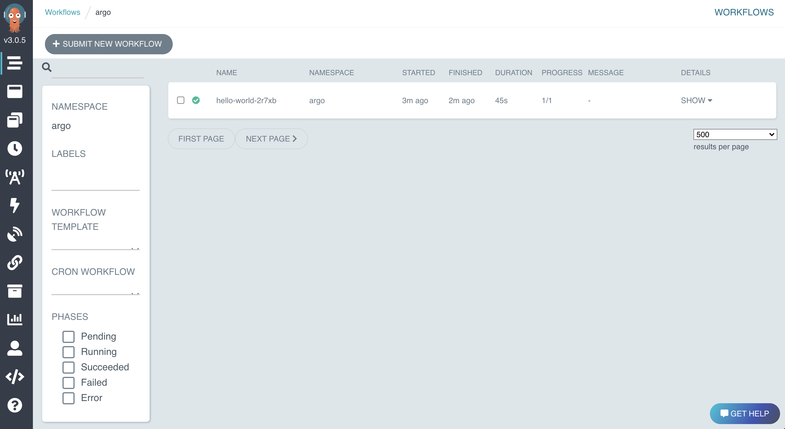
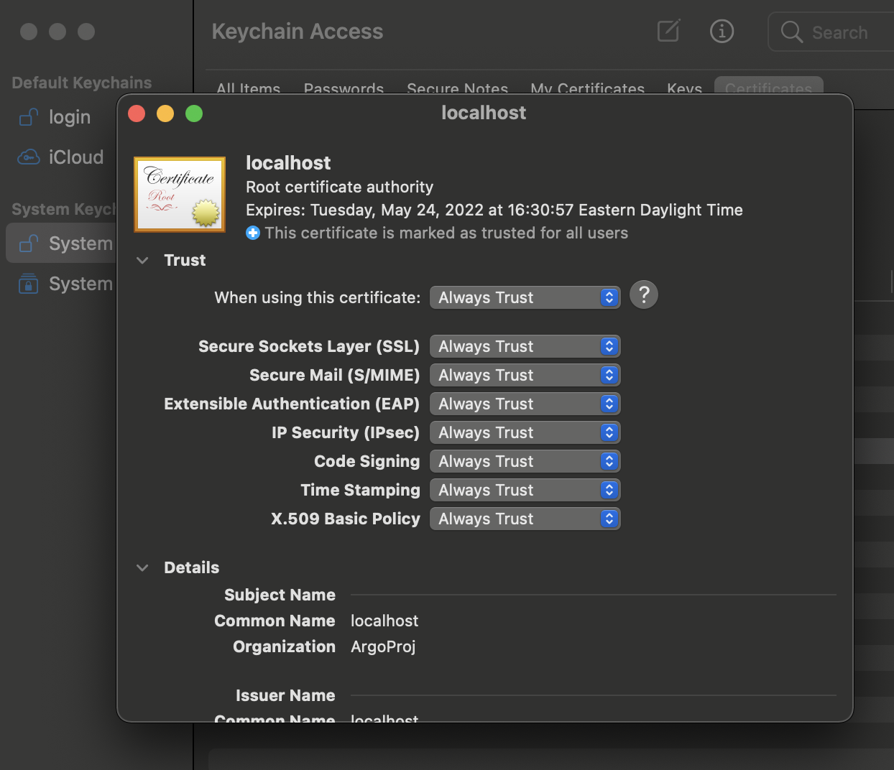

### Argo Workflows

## Argo CLI instructions

For details see: https://github.com/argoproj/argo-workflows/releases/tag/v3.0.5

### Mac

```bash
$ curl -sLO https://github.com/argoproj/argo/releases/download/v3.0.4/argo-darwin-amd64.gz
$ gunzip argo-darwin-amd64.gz
$ chmod +x argo-darwin-amd64
$ mv ./argo-darwin-amd64 /usr/local/bin/argo
$ argo version
```

### Linux

```bash
$ curl -sLO https://github.com/argoproj/argo/releases/download/v3.0.4/argo-linux-amd64.gz
$ gunzip argo-linux-amd64.gz
$ chmod +x argo-linux-amd64
$ mv ./argo-linux-amd64 /usr/local/bin/argo
$ argo version
```

This is the summary of the official [Argo Workflows Quick Start](https://argoproj.github.io/argo-workflows/quick-start/).

```bash
# start local k8s cluster
$ minikube start

# lunch argo
$ kubectl create ns argo
$ kubectl apply -n argo -f https://raw.githubusercontent.com/argoproj/argo-workflows/stable/manifests/quick-start-postgres.yaml
# On GKE, you may need to grant your account the ability to create new clusterroles
# kubectl create clusterrolebinding YOURNAME-cluster-admin-binding --clusterrole=cluster-admin --user=YOUREMAIL@gmail.com
# port forwarding for the local development
$ kubectl -n argo port-forward deployment/argo-server 2746:2746

# Hello World submission
$ argo submit -n argo --watch https://raw.githubusercontent.com/argoproj/argo-workflows/master/examples/hello-world.yaml
$ argo list -n argo
$ argo get -n argo @latest
$ argo logs -n argo @latest
```

WebUI access here: https://127.0.0.1:2746/



#### !Warning
Argo Workflows support https only, so add your local certificate into trusted to make the endpoint work:



