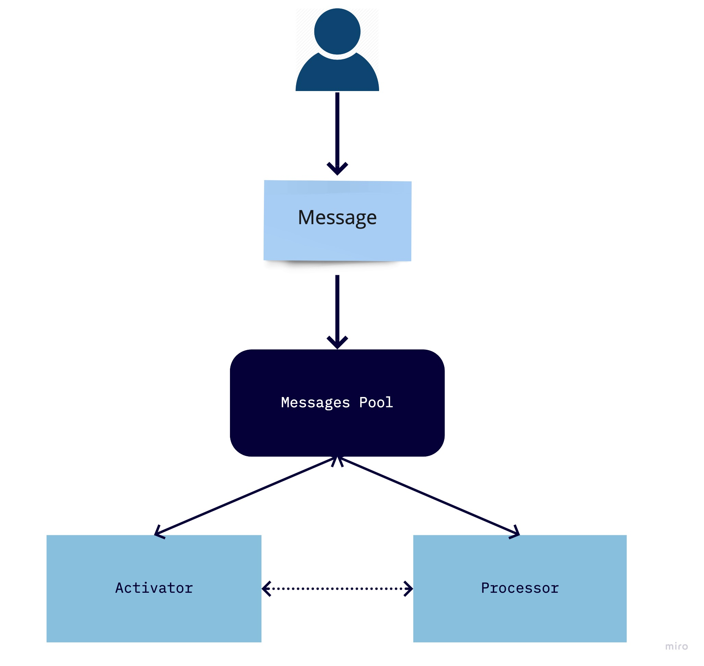
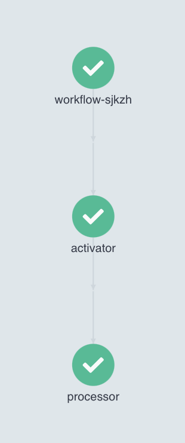
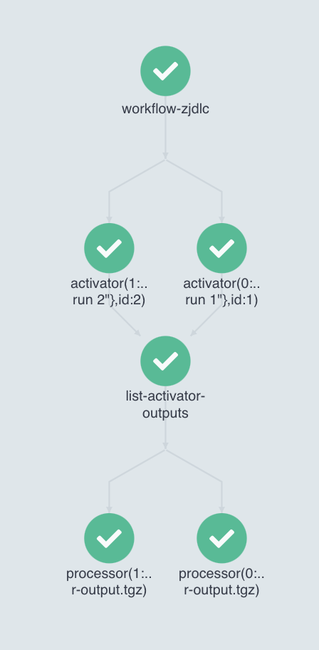

# Context

In the [Arch Document](https://github.com/azavea/nasa-hyperspectral/blob/feature/arch/docs/arch/v1/README.md) an imagery processing pipeline is described. There is made an assumption that Nextflow may be used for the pipeline orchestration.

This document is an attempt to mock up the pipeline architecture using Nextflow.

The mock up pipeline consists of two applications: `Activator` and `Processor` (see the [Diagram](#diagram)). Here, `Activator` and `Processor` are applications that consume the input message (JSON formatted) and send it into the destination.

At a very high level, the mock up workflow is going to look this way:

1. User generates the initial `Activator` message
2. `Activator` reacts to the incoming message, prints it, and sends message into `Processor`
3. `Processor` reacts to the incoming message and prints it

It can be visualized with the following [Diagram](#diagram):

## Diagram



## Argo Workflows

`Argo Workflows` is an open source container-native workflow engine for orchestrating parallel jobs on Kubernetes. `Argo Workflows` is implemented as a `Kubernetes CRD (Custom Resource Definition)`.

`Argo Workflows` are very similar to [already overviewed Kubeflow](../kubeflow/README.md). Every `workflow` definition is a yaml file (manifest). Each workflow can be a comibnation of `steps` or `tasks` (named dag steps). `Argo Workflows` takes care of resources passing (and handles that through minio, s3, gke, etc). It is possible explicitly to override locations of inputs and outputs and to see the result run in the webui. Locally it is possible to lunch `Argo Workflows` in a local k8s cluster. This allows to write the pipeline functional logic independently from the k8s cluster location.

## Solution №1



```yaml
apiVersion: argoproj.io/v1alpha1
kind: Workflow
metadata:
  generateName: workflow-
spec:
  entrypoint: workflow-template
  # workflow level input parameters
  arguments:
    parameters:
    - name: workflow-input
      value: |
        {"msg": "activator run"}

  # workflow steps description
  templates:
  - name: workflow-template
    steps:
    - - name: activator
        template: activator-template
        arguments:
          # activator input argument matches the workflow input
          parameters:
          - name: activator-input
            value: "{{workflow.parameters.workflow-input}}"
        
    - - name: processor
        template: processor-template
        arguments:
          # processor artifact is the output of the activation step
          artifacts:
          - name: processor-input
            from: "{{steps.activator.outputs.artifacts.activator-output}}"

  # implementations of the steps above
  - name: activator-template
    inputs:
      parameters:
      - name: activator-input
    # docker container settings
    container:
      image: nasa-hsi-argo
      imagePullPolicy: Never
      command: [python, /workdir/activator.py]
      args: ["{{inputs.parameters.activator-input}}"]
    # outputs locations
    outputs:
      artifacts:
      - name: activator-output
        path: /workdir/activator_event.json

  - name: processor-template
    inputs:
      artifacts:
      - name: processor-input
        path: /tmp/processor_event.json
    container:
      image: nasa-hsi-argo
      imagePullPolicy: Never
      command: [python, /workdir/processor.py]
      args: ["{{inputs.artifacts.processor-input.path}}"]
    outputs:
      artifacts:
      - name: processor-output
        path: /workdir/processor_event.json

```

The DSL above describes the pipeline itself.

* [Activator Sources](docker/src/activator.py)
* [Processor Sources](docker/src/processor.py)
* [workflow.yaml](docker/workflow.yaml)

### How to run

To run this `Argo Workflows` script enter the [docker directory](./docker) and run `make argo-run` command:

```bash
# Name:                workflow-sjkzh
# Namespace:           argo
# ServiceAccount:      default
# Status:              Succeeded
# Conditions:          
#  PodRunning          False
#  Completed           True
# Created:             Tue Jun 01 19:36:25 -0400 (21 seconds ago)
# Started:             Tue Jun 01 19:36:25 -0400 (21 seconds ago)
# Finished:            Tue Jun 01 19:36:45 -0400 (1 second ago)
# Duration:            20 seconds
# Progress:            2/2
# ResourcesDuration:   6s*(1 cpu),6s*(100Mi memory)
# Parameters:          
#   workflow-input:    {"msg": "activator run"}

# STEP               TEMPLATE            PODNAME                    DURATION  MESSAGE
#  ✔ workflow-sjkzh  workflow-template                                          
#  ├───✔ activator   activator-template  workflow-sjkzh-1565095264  4s          
#  └───✔ processor   processor-template  workflow-sjkzh-199039158   8s   
```

## Solution №2

What about parallelism within the single flow?



```yaml
apiVersion: argoproj.io/v1alpha1
kind: Workflow
metadata:
  generateName: workflow-
spec:
  entrypoint: workflow-template
  # control amount of simultaneous pods within a single workflow
  parallelism: 2
  arguments:
    # workflow input is a list of messages
    parameters:
    - name: workflow-input
      value: |
        [
          { 
            "id": "1",
            "event": {"msg": "activator run 1"} 
          },
          { 
            "id": "2",
            "event": {"msg": "activator run 2"} 
          }
        ]

  templates:
  - name: workflow-template
    dag:
      tasks:
      # spawns activator per input message
      - name: activator
        template: activator-template
        arguments:
          parameters:
          - name: activator-input
            value: "{{item.event}}"
          artifacts:
            - name: file
              s3:
                key: "activator/{{item.id}}"
        withParam: "{{workflow.parameters.workflow-input}}"
      
      # lists outputs produced by the previous step
      # it is a synchronization point
      - name: list-activator-outputs
        dependencies: [activator]
        template: list-activator-outputs-template
        arguments:
          parameters:
          - name: bucket
            value: my-bucket
          - name: key
            value: "{{workflow.name}}"
      
      # processes the in a parallel fashion the list of activator outputs
      - name: processor
        dependencies: [activator, list-activator-outputs]
        template: processor-template
        arguments:
          artifacts:
          - name: processor-input
            s3:
              key: "{{item}}"
        withParam: "{{tasks.list-activator-outputs.outputs.result}}"

  - name: list-activator-outputs-template
    inputs:
      parameters:
      - name: bucket
      - name: key
    data:
      source:
        artifactPaths:
          name: activator-outputs
          # it is possible to control how to handle input and output artifacts
          s3:
            endpoint: minio:9000
            insecure: true 
            bucket: "{{inputs.parameters.bucket}}"
            key: "{{inputs.parameters.key}}"
            accessKeySecret:
              name: my-minio-cred
              key: accesskey
            secretKeySecret:
              name: my-minio-cred
              key: secretkey
      transformation:
          - expression: "filter(data, {# endsWith \"output.tgz\"})"

  - name: activator-template
    inputs:
      parameters:
      - name: activator-input
    container:
      image: nasa-hsi-argo
      imagePullPolicy: Never
      command: [python, /workdir/activator.py]
      args: ["{{inputs.parameters.activator-input}}"]
    outputs:
      artifacts:
      - name: activator-output
        path: /workdir/activator_event.json
        s3:
          endpoint: minio:9000
          insecure: true 
          accessKeySecret:
            name: my-minio-cred
            key: accesskey
          secretKeySecret:
            name: my-minio-cred
            key: secretkey

  - name: processor-template
    inputs:
      artifacts:
      - name: processor-input
        path: /tmp/processor_event.json
    container:
      image: nasa-hsi-argo
      imagePullPolicy: Never
      command: [python, /workdir/processor.py]
      args: ["{{inputs.artifacts.processor-input.path}}"]
    outputs:
      artifacts:
      - name: processor-output
        path: /workdir/processor_event.json
        s3:
          endpoint: minio:9000
          insecure: true 
          accessKeySecret:
            name: my-minio-cred
            key: accesskey
          secretKeySecret:
            name: my-minio-cred
            key: secretkey


```

The DSL above describes the pipeline itself.

* [Activator Sources](docker/src/activator.py)
* [Processor Sources](docker/src/processor.py)
* [workflow.yaml](docker/workflow-minio-dag.yaml)

`Argo Workflows` parallel artifacts aggregation should be handled manually (like in this example), for more details see: https://github.com/argoproj/argo-workflows/issues/934

### How to run

To run this `Argo Workflows` script enter the [docker directory](./docker) and run `make argo-run-par` command:

```bash
# Name:                workflow-v294f
# Namespace:           argo
# ServiceAccount:      default
# Status:              Succeeded
# Conditions:          
#  PodRunning          False
#  Completed           True
# Created:             Tue Jun 01 19:53:15 -0400 (31 seconds ago)
# Started:             Tue Jun 01 19:53:15 -0400 (31 seconds ago)
# Finished:            Tue Jun 01 19:53:46 -0400 (now)
# Duration:            31 seconds
# Progress:            5/5
# ResourcesDuration:   9s*(1 cpu),9s*(100Mi memory)
# Parameters:          
#   workflow-input:    [
#   { 
#     "id": "1",
#     "event": {"msg": "activator run 1"} 
#   },
#   { 
#     "id": "2",
#     "event": {"msg": "activator run 2"} 
#   }
# ]

# STEP                                                                             TEMPLATE                         PODNAME                    DURATION  MESSAGE
#  ✔ workflow-v294f                                                                workflow-template                                                       
#  ├─✔ activator(0:event:{"msg":"activator run 1"},id:1)                           activator-template               workflow-v294f-878585926   4s          
#  ├─✔ activator(1:event:{"msg":"activator run 2"},id:2)                           activator-template               workflow-v294f-3677063183  4s          
#  ├─✔ list-activator-outputs                                                      list-activator-outputs-template  workflow-v294f-2411824227  2s          
#  ├─✔ processor(0:workflow-v294f/workflow-v294f-3677063183/activator-output.tgz)  processor-template               workflow-v294f-2560172454  6s          
#  └─✔ processor(1:workflow-v294f/workflow-v294f-878585926/activator-output.tgz)   processor-template               workflow-v294f-3753609845  7s 
```

## Consequences

`Argo Workflows` is a convenient tool for this pipeline orchestration. It allows to use benefits of the `K8S` and looks much less ML oriented than `Kubeflow` that is an interest of us already for a while. 

However, usage of `Argo Worflows` doesn't mean that we need to drop `Kubeflow` plans. It turns out that `Kubeflow` and `Argo Workflows` are compatible and compliment each other, see the following references, though that is a topic for a separate research:

* https://towardsdatascience.com/build-your-data-pipeline-on-kubernetes-using-kubeflow-pipelines-sdk-and-argo-eef69a80237c
* https://www.kubeflow.org/docs/components/pipelines/overview/pipelines-overview/

In addition to that, `Argo Workflows` provide a nice UI that consolidates metrics, inputs and outputs tracking. It allows to overcome AWS Vendor lock, simplifies the local development experience as well as the jobs deployment story.

In case there would be a need in Lambda functions or triggers there is the whole addition to `Argo Workflows` called [Argo Events](https://argoproj.github.io/argo-events/quick_start/) and [Argo CD](https://argoproj.github.io/projects/argo-cd) for the continuous delivery. 

One of the disadvantes compared to the `Nextflow` is the pipeline description language (it is yaml), but there is a [Argo Python DSL](https://github.com/argoproj-labs/argo-python-dsl) library that allows to use python to generate pipelines (just as a reminder to the reader, that to generate `Kubeflow` workflows we can use Kubeflow Python DSL as well). 
