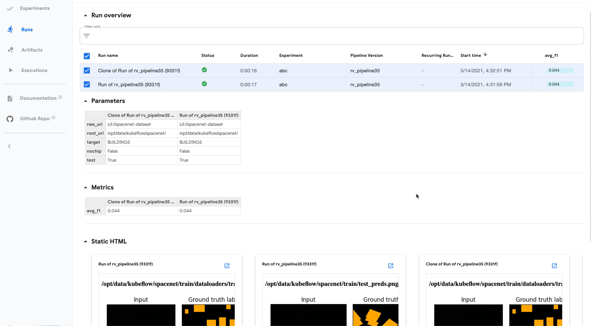

# Implementing a Raster Vision pipeline using Kubeflow

This was an exercise in implementing the standard RV pipeline using Kubeflow and trying out some machine learning-specific functionality.

## Setup

These instructions were adapted from the more general instructions [here](../README.md). This assumes `minikube` and `kubectl` are installed locally.

```sh
# start local k8s cluster with extra resources and volume mounting
minikube start --cpus 4 --memory 7946 --mount --mount-string=<data dir on local host>:/opt/data/

# install kubeflow
export PIPELINE_VERSION=1.4.1
kubectl apply -k "github.com/kubeflow/pipelines/manifests/kustomize/cluster-scoped-resources?ref=$PIPELINE_VERSION"
kubectl wait --for condition=established --timeout=60s crd/applications.app.k8s.io
kubectl apply -k "github.com/kubeflow/pipelines/manifests/kustomize/env/platform-agnostic-pns?ref=$PIPELINE_VERSION"
# expose UI to localhost:8080
kubectl port-forward -n kubeflow svc/ml-pipeline-ui 8080:80
# setup AWS secrets file in ~./aws/aws_secrets.yaml following https://www.kubeflow.org/docs/aws/pipeline/#s3-access-from-kubeflow-pipelines
kubectl -n kubeflow create -f ~/.aws/aws_secrets.yaml

# install Kubeflow DSL
pip3 install kfp

# build docker image in kubeflow environment
eval $(minikube docker-env)
cd kubeflow/rv
./docker/build

# generate ./rv_kubeflow/rv_pipeline.py.yaml and upload it via pipeline UI at localhost:8080
python3 ./rv_kubeflow/rv_pipeline.py
```

These commands can be useful for debugging a pending or failed step.
```sh
kubectl get pods -n kubeflow
kubectl describe -n kubeflow pod <pod id> | less
```

## Screenshots

You can use the UI to upload a pipeline yaml file.


Then, you can create and view past runs of pipelines. Cloning a run is a good way to try a variation on a previous run.


The pipeline graph updates as it runs. Nodes show the status and you can click on them to see logs, etc.


An experiment is a group of runs with a name. The table shows metrics for each run. You can select a subset of runs and then compare them. This will show the metrics and output for them side by side. Here, the output shows the dataloader and test predictions.




## Observations
* The pipeline graph cannot be constructed dynamically as function of pipeline parameters, so the pipeline needs to be re-compiled and uploaded any time the structure changes. For example, this needs to be happen if the number of splits changes. This is reminiscent of how Theano and the old Tensorflow worked -- Python code was used to compile a static function graph.
* There's no way to join a parallel-for (see https://github.com/kubeflow/pipelines/issues/3412), but I was able to implement split command by using a for loop to create a separate instance of each split command.
* It's not possible to use an image as the output of a run. There are only a few output types that are supported and "image" is not one of them. See https://www.kubeflow.org/docs/components/pipelines/sdk/output-viewer/. To get an image, I had to create a webpage with an image base64 encoded in it. An alternative route would be logging images to Tensorboard, and then adding a Tensorboad output item, which is supported.
* In the experiment table view, you cannot sort by metrics, and the run parameters are not included.
* Overall: It took some trial and error and some kludgey things to get this working, but it should be easier in the future now that's we've established a pattern. The pipeline functionality seems relatively solid and polished. However, the experiment metrics and output views are pretty rudimentary, and a Jupyter+Pandas+Matplotlib approach for viewing experiment output seems preferable at this time.
