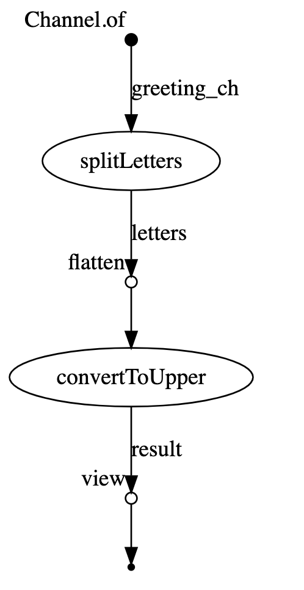

## Tutorial

This is a bit modified and dockerized implementation of the [Nextflow tutorial](https://www.nextflow.io/docs/latest/getstarted.html).
The `Nextflow` DSL is implemented with the `Nextflow DSL v1`:

```nextflow
// input string
params.greeting = 'Hello world!'
// explicit channel definition
// nextflow processes communicate through FIFO queues that are called channels
// it is not neccesary to set channel here an an explicit input for the process
greeting_ch = Channel.of(params.greeting)

// process that splits the input string into separate letters and writes them into files
process splitLetters { 
  input:
  val x from greeting_ch

  output:
  file 'chunk_*' into letters

  """
  printf '$x' | split -b 6 - chunk_
  """
}

// process that reads chunks and builds it up into a phrase
process convertToUpper {
  input:
  file y from letters.flatten()

  output:
  stdout into result

  """
  cat $y | tr '[a-z]' '[A-Z]'
  """
}

// view the contents of the convertToUpper process output
result.view { it.trim() }
```



- [docker.nd](./docker.nf)
- [nextflow.config](./nextflow.config)

## How to start

```bash
$ make nextflow-run    

# nextflow run docker.nf -with-trace -with-timeline -with-dag -with-report
# N E X T F L O W  ~  version 20.10.0
# Launching `docker.nf` [determined_mcnulty] - revision: 639a1f4573
# executor >  local (3)
# [be/364973] process > splitLetters (1)   [100%] 1 of 1 ✔
# [9c/825df3] process > convertToUpper (1) [100%] 2 of 2 ✔
# WORLD!
# HELLO

```
