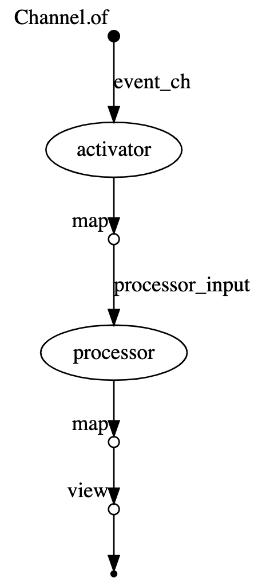

## Dockerized stub pipeline implementation

At a very high level, workflow looks this way:

1. User generates the initial `Activator` message
2. `Activator` reacts to the incoming message, prints it, and sends message into `Processor`
3. `Processor` reacts to the incoming message and prints it.

```nextflow
// In this example we used the new Nextflow DSL
// https://www.nextflow.io/docs/latest/dsl2.html
nextflow.enable.dsl=2

process activator { 
  // all nextflow porcesses in this example would be containerized
  container '513167130603.dkr.ecr.us-east-1.amazonaws.com/nasa-hsi-v2-nextflow:latest' 
  // error strategy specification
  errorStrategy 'retry'
  maxErrors 5

  // process input argument
  input:
  val event

  // process output
  output:
  file 'activator_event.json'

  // process execution script
  shell:
  '''
   python /workdir/activator.py '!{event}'
  '''
}

process processor {
  // all nextflow porcesses in this example would be containerized
  container '513167130603.dkr.ecr.us-east-1.amazonaws.com/nasa-hsi-v2-nextflow:latest' 
  // error strategy specification
  errorStrategy 'retry'
  maxErrors 5

  // process input argument
  input:
  val event

  // process output
  output:
  file 'processor_event.json'

  // process execution script
  shell:
  '''
  python /workdir/processor.py '!{event}'
  '''
}

workflow {
  // variables init
  params.event = ''
  params.event_type = ''

  // input events channel definition
  event_ch = Channel.of(params.event)
  
  // describe different workflow behavior 
  // depending on input parameters
  if(params.event_type == 'activator') {
    // the output of the activator process is file 
    // to print it: its content should be loaded an covnerted into strings
    activator(event_ch)
      .map(file -> file.text)
      .view()
  } else if (params.event_type == 'processor') {
    processor(event_ch)
    // an alternative to direct processes composition
    // it is possible to call process.out to get process output
    // the output of the processor process is file 
    // to print it: its content should be loaded an covnerted into strings
    processor
      .out
      .map(file -> file.text)
      .view()
  } else {
    // the output of the processor process is file 
    // to print it: its content should be loaded an covnerted into strings
    processor(activator(event_ch).map(file -> file.text))
      .map(file -> file.text)
      .view()
  }
}
```



The DSL above describes the pipeline itself. `Nextflow` allows to specify extra `nextflow.config` file that configures settings 
that are common for `Nextflow` processes described via DSL:

```nextflow
// a default docker container for all processes
process.container = '513167130603.dkr.ecr.us-east-1.amazonaws.com/nasa-hsi-v2-nextflow:latest'
// enable docker executor for all underlying processes
docker.enabled = true
```

* [Activator Sources](batch/activator.py)
* [Processor Sources](batch/processor.py)
* [docker.nf](docker.nf)
* [nextflow.config](nextflow.config)

## How to start

```bash
$ make docker-build
# one of commands: nextflow-run, nextflow-run-activator, nextflow-run-processor
$ make nextflow-run    

# nextflow run docker.nf -with-trace -with-timeline -with-dag -with-report --event '{"msg": "workflow run"}'
# N E X T F L O W  ~  version 20.10.0
# Launching `docker.nf` [high_euclid] - revision: c119b6fa3d
# executor >  local (2)
# [75/7d965b] process > activator (1) [100%] 1 of 1 ✔
# [2c/d9cbf0] process > processor (1) [100%] 1 of 1 ✔
# {"msg": "workflow run"}
```
