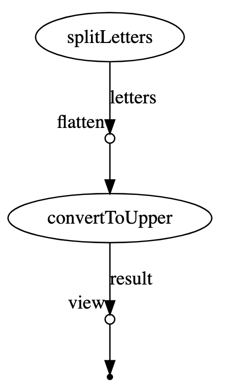

## Tutorial

This is an implementation of the [Nextflow tutorial](https://www.nextflow.io/docs/latest/getstarted.html).
The `Nextflow` DSL is implemented with the `Nextflow DSL v1`:

```nextflow
// input string
params.str = 'Hello world!'

// process that splits the input string into separate letters and writes them into files
process splitLetters {
    output:
    file 'chunk_*' into letters

    """
    printf '${params.str}' | split -b 6 - chunk_
    """
}

// process that reads chunks and builds it up into a phrase
process convertToUpper {
    input:
    file x from letters.flatten()

    output:
    stdout result

    """
    cat $x | tr '[a-z]' '[A-Z]'
    """
}

// view the contents of the convertToUpper process output
result.view { it.trim() }
```



- [tutrorial.nd](./tutorial.nf)

## How to start

```bash
$ make nextflow-run

# nextflow run tutorial.nf -with-trace -with-timeline -with-dag -with-report
# N E X T F L O W  ~  version 20.10.0
# Launching `tutorial.nf` [magical_torricelli] - revision: 8525843a28
# executor >  local (3)
# [95/50e4a5] process > splitLetters       [100%] 1 of 1 ✔
# [80/da0e03] process > convertToUpper (1) [100%] 2 of 2 ✔
# WORLD!
# HELLO
```
